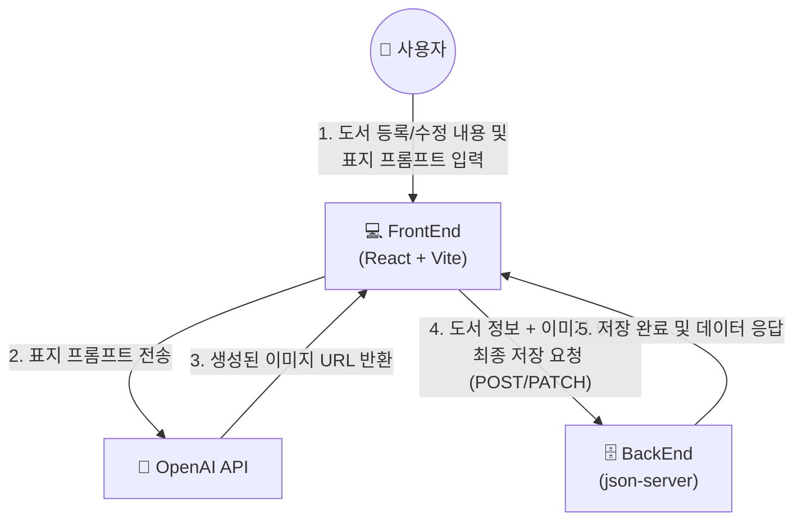
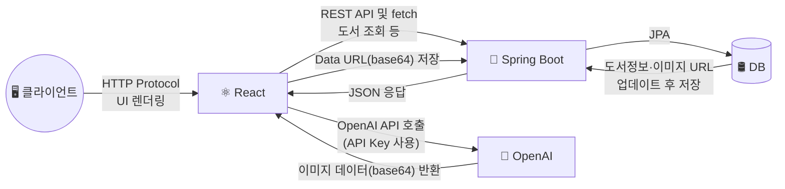

# 📚 도서 관리 시스템

> KT AIVLE School AI 트랙 미니 프로젝트 5차 12조 BackEnd


<br>

## 📌 목차

- [프로젝트 소개](#-프로젝트-소개)
- [개발 기간](#-개발-기간)
- [팀 R&R](#-팀-rr)
- [기술 스택](#-기술-스택)
- [ERD](#-erd)
- [프로젝트 구조](#-프로젝트-구조)
- [API 엔드포인트](#-api-엔드포인트)
- [기능 설명](#-기능-설명)
- [설치 및 실행 방법](#-설치-및-실행-방법)
- [화면 미리보기](#-화면-미리보기)
- [트러블슈팅](#-트러블슈팅)

<br>

## 🖥 프로젝트 소개

<!-- 프로젝트 배경, 목적, 간단한 설명을 작성하세요 -->
기존 Frontend 미니프로젝트(json-server 기반)를 분석하여, 실제 Spring Boot + MySQL 백엔드로 전환하는 프로젝트입니다.

### Before — Frontend 단독 구조 (json-server)



### After — FullStack 구조 (Spring Boot + MySQL)



<br>

## 📅 개발 기간

2026.06.09 ~ 2026.06.12

<br>

## 👥 팀 R&R

| 이름 | 역할           | 담당 기능        |
|------|--------------|--------------|
| 박태정 | 조장  | PM·기획, AI/Frontend 연동 |
| 김다진 | PPT          | 백엔드 개발 (1)   |
| 황민서 | 검토담당자        | 백엔드 개발 (2)   |
| 배수성 | 타임키퍼         | 백엔드 개발 (2)   |
| 유지은 | 발표자          | 백엔드 개발 (3)   |
| 이채은 | 서기           | AI/Frontend 연동 |
| 김다애 | PPT          | 통합/예외 처리     |

<br>

## 🛠 기술 스택

### Environment
  

### Backend
     

### Frontend
     

### Communication
   

<br>

## 🗂 ERD

<!-- ERD 이미지를 아래에 첨부하세요 -->
<!--  -->

```
USERS
- id (PK)               유저 고유번호
- email (UK)            이메일 (로그인 ID)      @NotNull @Unique
- password              암호화된 비밀번호        @NotNull
- nickname (UK)         닉네임                  @NotNull @Unique
- created_at                                    @PrePersist 자동 설정
 
PROFILES
- id (PK, FK)           유저 고유번호 (1:1)      @MapsId
- bio                   자기소개                 @NotNull
- avatar                아바타 이미지 주소        @NotNull
- created_at                                    @PrePersist 자동 설정
 
BOOK
- id (PK)               도서 고유번호
- author_id             작가(User) 고유번호
- title                 도서 제목
- author                작가명
- content (LONGTEXT)    도서 본문 / 소개 내용
- cover_image_url       AI 생성 표지 이미지 URL  (LONGTEXT)
- genre                 장르
- publisher             출판사
- price                 가격
- pages                 페이지 수
- isbn                  ISBN 번호
- pub_date              출판일
- view_count            조회수                  @PrePersist 기본값 0
- created_at                                    @PrePersist 자동 설정
- updated_at                                    @PreUpdate 자동 갱신
 
FAVORITE
- id (PK)               즐겨찾기 고유번호
- user_id (FK)          유저 고유번호            @NotNull
- book_id (FK)          도서 고유번호            @NotNull
- created_at                                    @PrePersist 자동 설정
* UNIQUE (user_id, book_id)
 
FOLLOW
- id (PK)               팔로우 고유번호
- follower_id           팔로우 하는 유저 ID      @NotNull
- following_id          팔로우 대상 유저 ID      @NotNull
- created_at
 
COMMENT
- id (PK)               댓글 고유번호
- book_id               도서 고유번호            @NotNull
- user_id               유저 고유번호            @NotNull
- content               댓글 내용               @NotNull
- rating                별점 (1~5)              @NotNull
- created_at
- updated_at
```

<br>

## 📂 프로젝트 구조

```
book-backend/src/main/java/com/aivle12/book_backend/
├── domain/
│   ├── Book.java                  # 도서 Entity (@PrePersist/@PreUpdate 자동 시간 설정, 조회수)
│   ├── Comment.java                # 댓글 Entity (bookId, userId, rating)
│   ├── Favorite.java               # 즐겨찾기 Entity (UNIQUE: user_id + book_id)
│   ├── Follow.java                 # 팔로우 Entity (followerId, followingId)
│   └── User.java                   # 회원 Entity (email, nickname Unique)
├── dto/                             # 요청/응답 DTO (Entity 직접 노출 방지)
├── repository/                      # JpaRepository 상속, 도메인별 CRUD/조회 메서드
├── service/
│   ├── AuthService.java            # 회원가입/로그인/내정보, 비밀번호 암호화·JWT 발급
│   ├── BookService.java            # 도서 CRUD, 조회수 증가, 표지 변경 (@Transactional)
│   ├── AiCoverService.java         # OpenAI 이미지 생성 API 호출, 표지 3장 생성
│   ├── CommentService.java         # 댓글 CRUD
│   ├── FavoriteService.java        # 즐겨찾기 등록/삭제
│   └── FollowService.java          # 팔로우/언팔로우, 팔로잉·팔로워 목록 조회
├── controller/
│   ├── UserController.java         # /users - 회원가입, 로그인, 내정보, 중복확인
│   ├── BookController.java         # /books - CRUD, 조회수 증가, AI 표지 생성
│   ├── CommentController.java      # /books/{bookId}/comments, /comments/{id}
│   ├── FavoriteController.java     # /books/{bookId}/favorites
│   └── FollowController.java       # /authors/{id}/follows, /users/followings|followers
├── security/
│   ├── JwtTokenProvider.java       # JWT 토큰 생성/검증/userId 추출
│   └── JwtAuthenticationFilter.java # 요청마다 JWT 검증 후 SecurityContext에 인증정보 설정
├── exception/                       # 커스텀 예외 + GlobalExceptionHandler(전역 예외 처리)
├── config/
│   ├── SecurityConfig.java         # Spring Security 설정 (JWT 필터, 인가 규칙, BCrypt)
│   └── WebConfig.java              # CORS 설정 (프론트 localhost:5173 연동)
└── BookBackendApplication.java

src/main/resources/
└── application.yaml                # MySQL DB 연결, JPA, JWT, OpenAI API Key 설정
```

<br>

## 🔌 API 엔드포인트

> 📋 [API 명세서 (Notion)](https://app.notion.com/p/API-Docs-cc1302230b42838fa095018595e8b1c7)

<br>

## 💡 기능 설명

| 기능                   | 설명                                                                          |
|----------------------|-----------------------------------------------------------------------------|
| 🔐 회원가입 / 로그인 / 로그아웃 | - JWT 기반 인증을 통해 사용자 회원가입, 로그인, 로그아웃 기능 제공 <br> - 로그인 후 마이페이지와 사용자별 기능 접근 가능 |
| 👤 개인 프로필 관리         | - 사용자별 프로필 페이지 기능 제공 <br> - 마이페이지에서 등록한 책, 즐겨찾기, 팔로우 확인 가능                  |
| 🤝 팔로우 / 언팔로우        | - 사용자 간 팔로우 및 언팔로우 기능 제공 <br> - 팔로워·팔로잉 목록을 통해 사용자 간 연결 관계 확인 가능            |
| ⭐ 댓글 기반 평점           | - 도서별 댓글 작성과 함께 평점 등록 기능 제공 <br> - 사용자 리뷰를 기반으로 도서 평가와 피드백 확인 가능            |
| 🔎 상세 검색             | - 제목, 작가 외에도 출판사, 가격, 리뷰 평점, 출판연도 별로 필터링해서 검색 가능                            |

<br>

## ⚙️ 설치 및 실행 방법

### 사전 요구사항

- Java 17+
- Node.js / npm
- MySQL

### 환경 변수 설정

**Backend** — 프로젝트 루트에 `.env` 파일 생성:
```
DB_HOST=localhost
DB_PORT=3306
DB_NAME=book_db
DB_USERNAME=root
DB_PASSWORD=
OPENAI_API_KEY=
```

**Frontend** — 프론트엔드 루트에 `.env` 파일 생성:
```
VITE_API_BASE_URL=http://localhost:8080
```

### Backend 실행

```bash
# 1. 저장소 클론
$ git clone https://github.com/aivleschool-miniproject12/BackEnd.git
 
# 2. 디렉토리 이동
$ cd BackEnd

IntelliJ에서 `BookappApplication.java` 실행
```

### Frontend 실행

```bash
$ git clone https://github.com/aivleschool-miniproject12/Frontend.git
$ npm install
$ npm run dev
```

<br>

## 🖼 화면 미리보기

| 페이지      | 미리보기 |
|----------|------|
| 회원가입     | https://github.com/user-attachments/assets/0687a2e2-e249-4037-b284-bc4b039d534a     |
| 로그인      | https://github.com/user-attachments/assets/bcc3afc9-b468-4477-9e58-a0833ac777cf     |
| 상세 검색 토글 | https://github.com/user-attachments/assets/8fe5320a-925a-4fec-bcf8-aaa80fca9385     |
| 작가 프로필   | https://github.com/user-attachments/assets/f441bcd2-05dd-4aa9-b975-c649ef7e869d     |
| 댓글·리뷰 등록 | https://github.com/user-attachments/assets/7df77735-470f-477b-ae92-9330ce57d1d8     |
| 팔로우 신청   | https://github.com/user-attachments/assets/df19d51c-39c7-42b8-bca3-ea357cbd0da6     |

